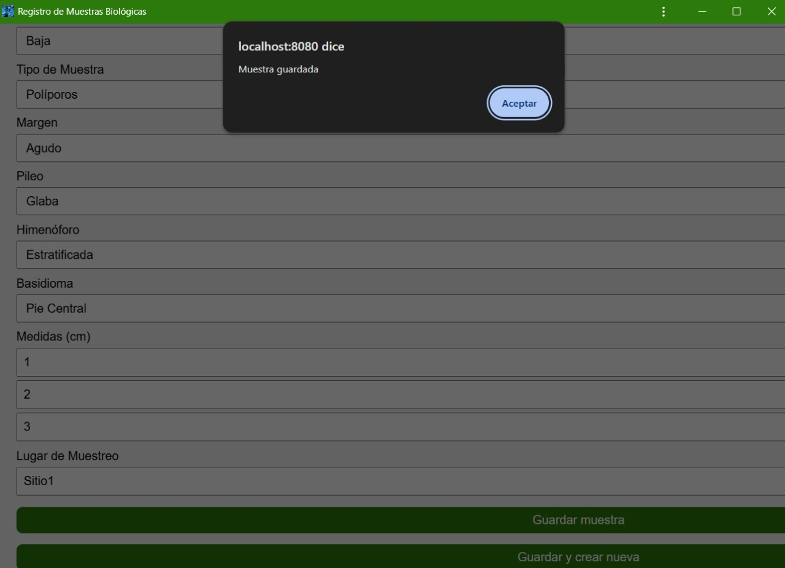
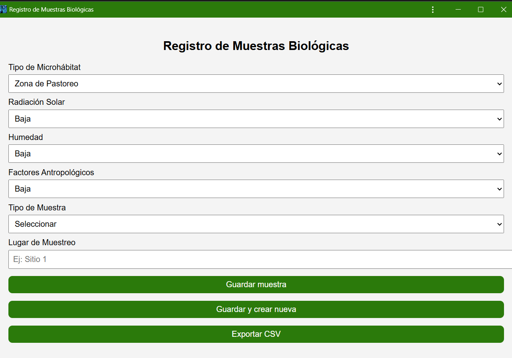

# Aplicación Offline para Recolección de Datos en Campo

Aplicación desarrollada para permitir la toma de muestras en zonas sin conexión a internet, con la posibilidad de exportar los datos recopilados a un archivo CSV para análisis posterior.

## 🎯 Objetivo
Facilitar la recolección de datos en trabajos de campo donde el acceso a internet es limitado o inexistente, asegurando la conservación de la información hasta su análisis.

## 🧰 Funcionalidades
- Registro de muestras sin conexión
- Almacenamiento local temporal
- Exportación a archivo CSV
- Interfaz adaptada para dispositivos móviles

## 🛠️ Tecnologías utilizadas
- HTML
- CSS
- JavaScript

## 📷 Evidencias de funcionamiento

| Exportación a CSV | Muestras guardadas | Registro de muestras |
|------------------|-------------------|----------------------|
|  |  |  |

